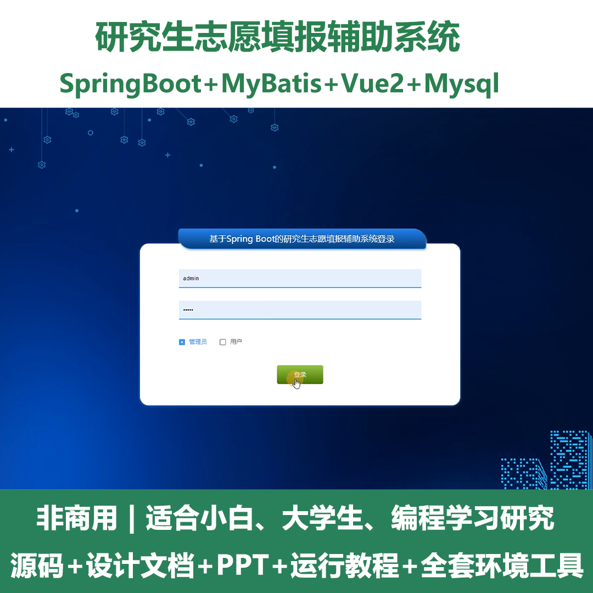
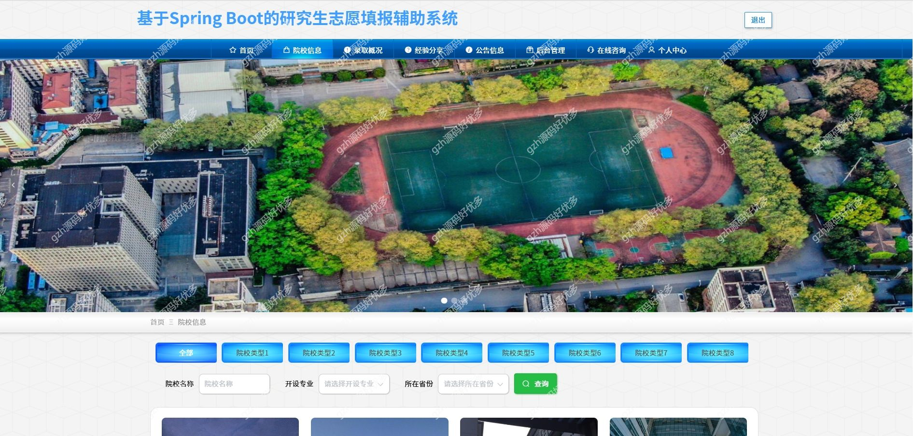
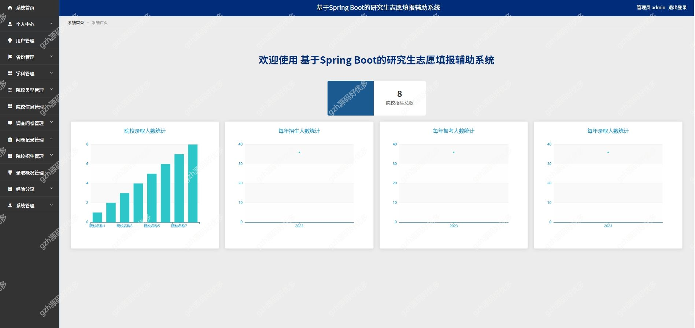
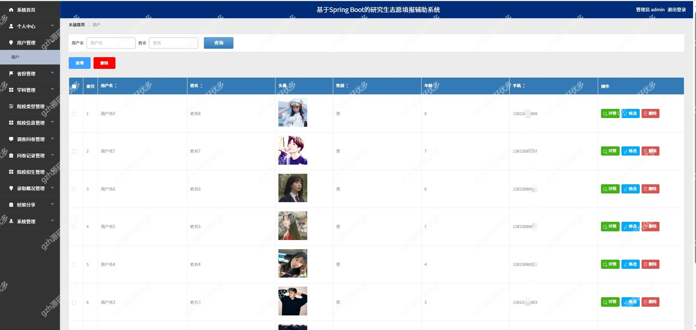
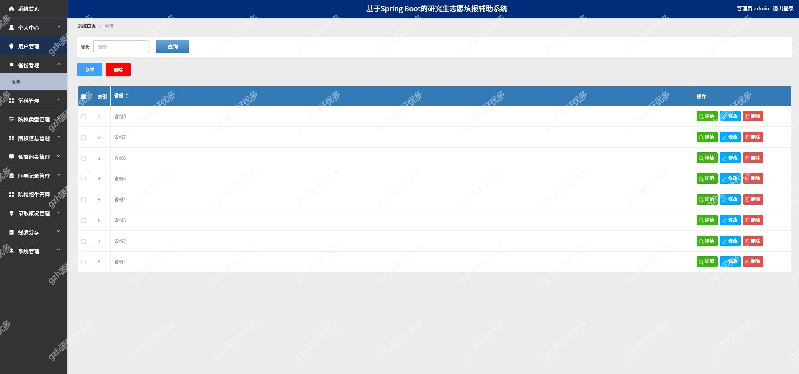
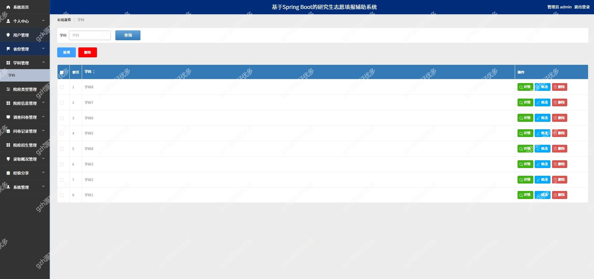
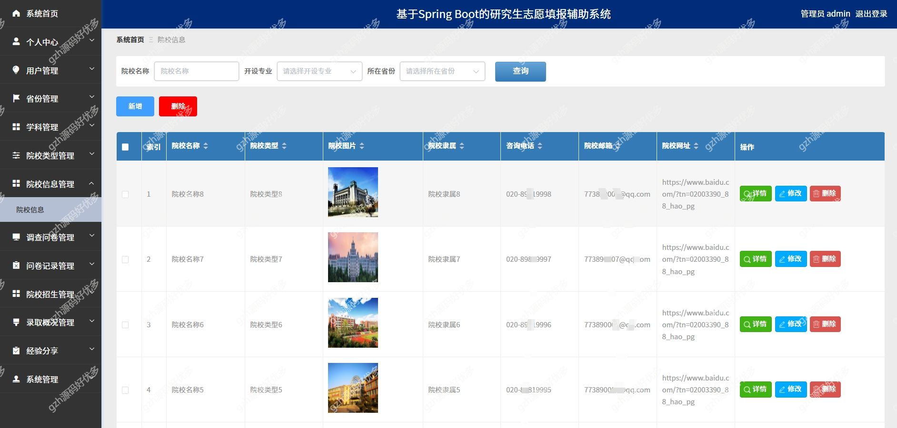
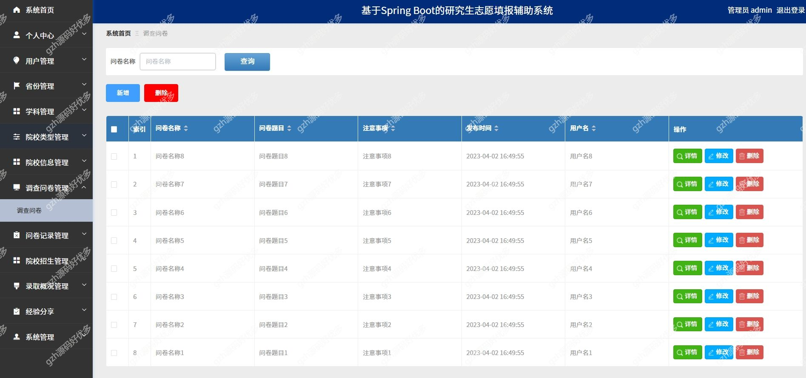

# springbootA333
springbootA333研究生志愿填报辅助系统
 
## 查看主页获取源码

### 一、关键词
研究生志愿填报辅助系统，研究生辅助系统

### 二、作品包含
源码+数据库+万字设计文档+PPT+全套环境和工具资源+本地部署教程

### 三、项目技术
前端技术：Html、Css、Js、Vue2.0、Element-ui 
后端技术：Java、SpringBoot2.0、MyBatis

### 四、运行环境（以下版本亲测，其他版本兼容性请自行测试）
开发工具：IDEA/eclipse  + VSCODE
数据库：MySQL5.7

数据库管理工具：Navicat10以上版本

环境配置软件： JDK1.8 + Maven3.6.3

前端Nodejs：14

浏览器：谷歌浏览器

### 五、项目介绍
项目编号：springbootA333

二十一世纪我们的社会进入了信息时代，信息管理系统的建立，大大提高了人们信息化水平。传统的管理方式对时间、地点的限制太多，而在线管理系统刚好能满足这些需求，在线管理系统突破了传统管理方式的局限性

不同用户具有不同权限的操作功能，在用户模块，主要有用户进行注册和登录，用户可以实现查看院校信息、公告信息、在线咨询，还能修改个人信息等；在管理员模块，管理员可以对用户信息、院校信息、调查问卷、问卷记录、院校招生等进行相应的操作

### 六、运行截图

